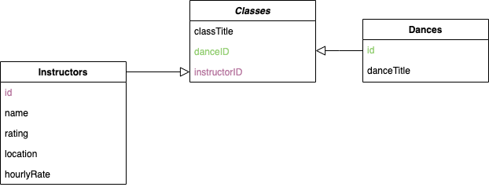
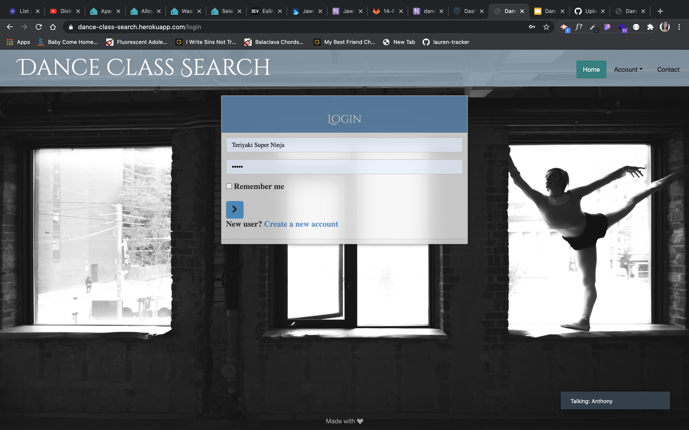
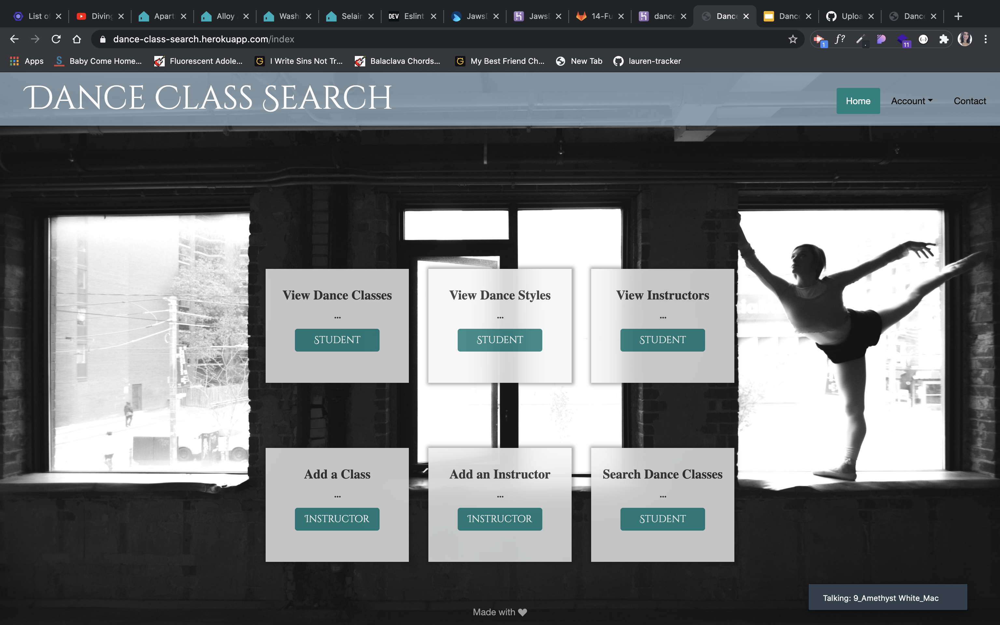

<h1 align="center">Dance Class Database</h1>

## Application Description

This is a full-stack web application that uses the MVC paradigm 
and our own server-side API to produce a database for different dance classes. These dance classes can be accessed by students or teachers, they can be searched using numerous identifiers. Classes and Instructors can also be added to the database.

## Table of Contents
- [Description](#description)
- [User Story](#user-story)
- [Technologies Used](#technologies-used)
- [Installation](#installation)
- [Future Development](#future-development)

💻 HTML generated:
===================
[Live Application on Heroku](https://dance-class-search.herokuapp.com/login)

🎥 Figure Showing the Three Tables:
==============================


🎥 Login Page:
==============================


🎥 Main Page:
==============================



## User Story

```
AS A student I want be able to search through dance classes,
I WANT to be able to look through new styles of dance and instructors,
SO THAT I can find more lessons to take.

AS A teacher I want to be able to post about new classes,
I WANT to be able to add new classes and instructors,
SO THAT I can offer more variety to students.
```

## Technologies used
```
- Express-Session + Express
- Handlebars
- Passport
- MySQL
- Sequelize
- EsLint
- Clickup
- Figma
- bcryptjs
- Travis (the testing framework that you hooked up to our repo)
- Heroku
```

## Installation
```
- None needed through live application
```

## Future development
```
One of our main goals in future development in the backend, is to implicate user authenticity to restrict and allow different features based on if a teacher or student logs in.  

Some future plans for the front end will be to link demo videos to different dance types and to allow users to make simple profiles where classes can be saved.
```